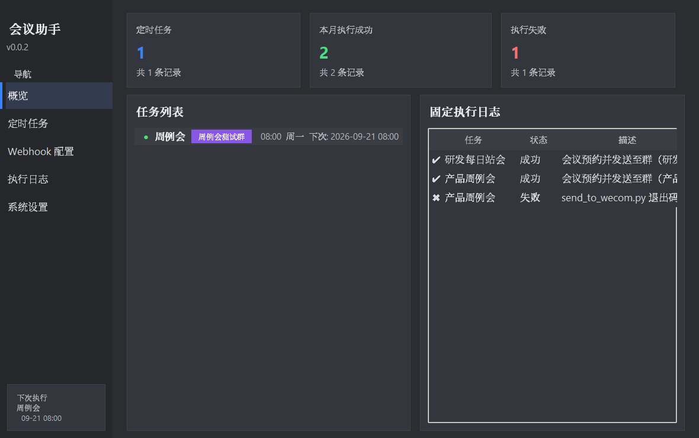
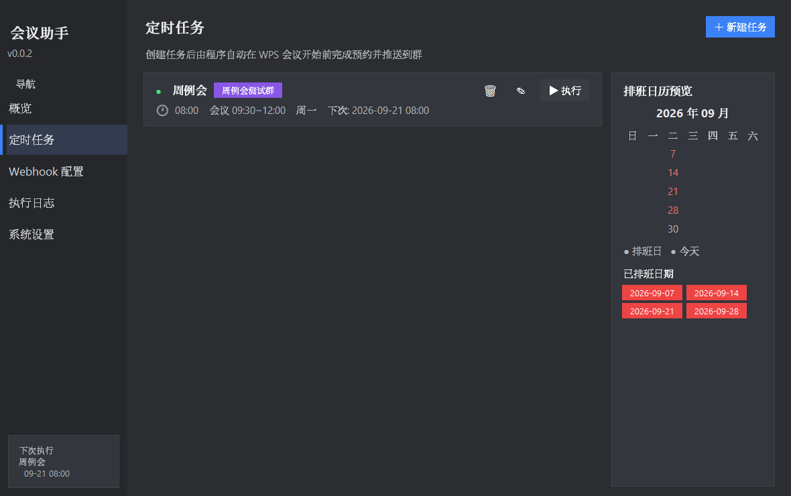
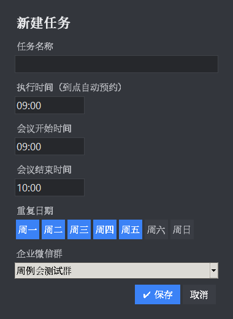
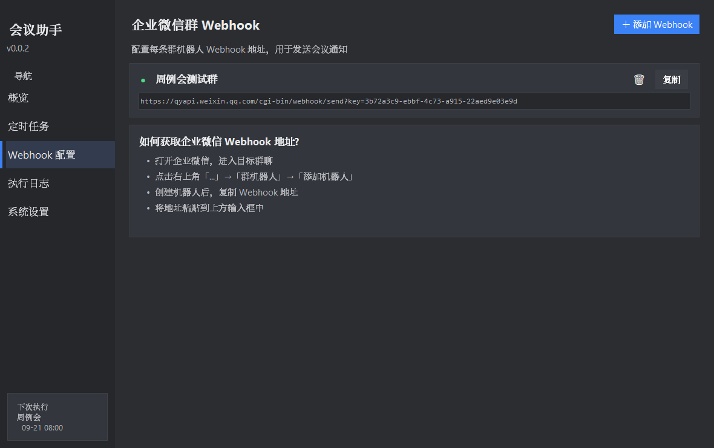
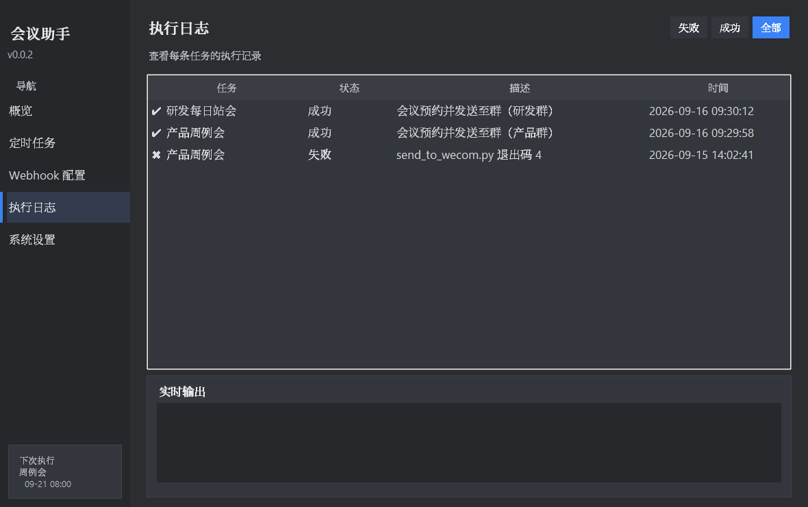
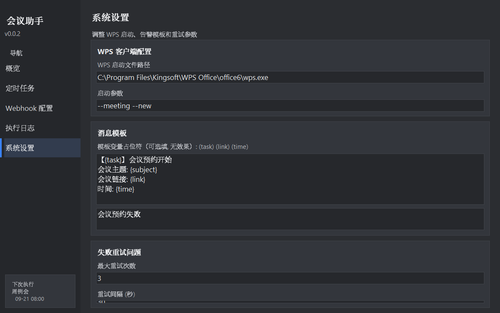

# tool-auto

自动化预约 WPS 会议并推送到企业微信群。提供 Windows 桌面客户端（GUI）
与命令行脚本两种使用方式。

## 功能

- 自动启动 WPS 会议并点击「预约会议」
- 按配置自动填写会议主题、开始/结束时间并保存
- 自动分享会议并复制邀请信息（含入会链接）到剪贴板
- 通过企业微信群机器人 Webhook 推送到指定群聊
- 桌面客户端：定时任务管理、排班日历、执行日志、系统设置

## 界面预览（v0.0.2 GUI 客户端）

### 概览

统计卡片（定时任务数、本月执行成功/失败）+ 任务列表 + 最近执行日志一览。



### 定时任务

任务卡片（启停开关、执行时间、会议时间段、重复日期、下次执行时间），
右侧排班日历预览与已排班日期；支持立即执行一次、编辑、删除。



### 新建任务

填写任务名称、执行时间（到点自动预约）、会议开始/结束时间、重复日期、
推送的目标企业微信群；保存后即纳入自动调度。



### Webhook 配置

按群维护企业微信群机器人 Webhook 地址（可复制、删除），附获取地址指引。



### 执行日志

全部/成功/失败筛选的历史执行记录，以及调度运行时的实时输出。



### 系统设置

WPS 客户端启动配置、消息模板、失败重试次数与间隔。



## GUI 更新说明（v0.0.2）

- 新增 Tkinter 深色桌面客户端（Windows 高 DPI 适配，125%/150% 缩放下不模糊）
- 定时任务调度：后台线程到点自动执行「预约 → 填表 → 复制 → 推送」全流程，
  同一任务同一天只执行一次，失败可按设置自动重试
- 执行时间与会议开始/结束时间分离：到执行时间触发预约，会议时间写入表单
- 每条任务可绑定不同企业微信群（不同 Webhook）
- 任务卡片支持「▶ 执行」立即执行一次（与调度互斥，避免同时操作 WPS）
- 执行日志持久化保存，支持成功/失败筛选与实时输出查看

## 环境要求

- Windows + Python 3.8+
- 依赖：`opencv-python`、`numpy`、`Pillow`
- WPS 会议客户端（wpsmeeting）
- 企业微信群机器人 Webhook 地址（群设置 → 群机器人 → 添加）

## 配置

编辑 `meeting_config.json`：

```json
{
  "subject": "周例会",
  "start_time": "2026/10/01 09:30",
  "end_time": "2026/10/01 11:30"
}
```

在 `wecom_webhook.txt` 第一行填入群机器人 Webhook 地址，
或设置环境变量 `WECOM_WEBHOOK`（二选一，密钥请勿提交到仓库）。

## 配置企业微信 Webhook（wecom_webhook.txt）

该文件含机器人密钥，出于安全考虑**没有提交到仓库**，需要自己创建。

### 第 1 步：获取 Webhook 地址

1. 打开企业微信的目标群聊 → 右上角「...」→ **群机器人** → **添加机器人**
2. 创建后复制 Webhook 地址，形如：

```
https://qyapi.weixin.qq.com/cgi-bin/webhook/send?key=xxxxxxxx-xxxx-xxxx-xxxx-xxxxxxxxxxxx
```

（注意：机器人只能在**企业内部群**添加，客户群不支持。）

### 第 2 步：创建配置文件

在**项目根目录**（即 `run_meeting.py` 等脚本所在目录）新建文本文件
`wecom_webhook.txt`，把地址完整粘贴到**第一行**，保存为 UTF-8 编码：

```
wecom_webhook.txt
├── 与 click_reserve_meeting.py、send_to_wecom.py 等脚本同级
└── 内容只有一行：完整的 Webhook 地址
```

文件内容范例：

```
https://qyapi.weixin.qq.com/cgi-bin/webhook/send?key=xxxxxxxx-xxxx-xxxx-xxxx-xxxxxxxxxxxx
```

（`key=` 后面就是你的机器人密钥，粘贴时保持地址完整、不要加引号。）

### 替代方式：环境变量

不想用文件的话，也可以设置系统环境变量 `WECOM_WEBHOOK`，值为同样的
Webhook 地址。脚本读取优先级：**环境变量 > wecom_webhook.txt 文件**。

### 常见错误

| 现象 | 原因 |
| --- | --- |
| 提示「未配置企业微信机器人 Webhook」 | 文件不存在/不在脚本同目录，或环境变量未设置 |
| 企业微信返回 `errcode: 93000` | Webhook key 无效或机器人已被删除 |
| 企业微信返回 `errcode: 45009` | 触发频控（每个机器人每分钟最多 20 条） |

## 使用

推荐使用桌面客户端（配置任务后自动调度执行，无需人工值守）：

```bash
python gui_app.py            # 打开 GUI：新建定时任务 / 管理 Webhook / 查看日志
```

命令行方式（单次手动执行）：

```bash
python run_meeting.py        # 全流程：预约 → 填表 → 保存 → 复制 → 发群
```

分步执行：

```bash
python click_reserve_meeting.py   # 只创建会议
python fill_meeting_form.py       # 只填表并保存
python copy_meeting_info.py       # 只分享并复制会议信息
python send_to_wecom.py           # 只发送到企业微信群（内容取剪贴板）
```

各脚本均支持 `--dry-run`（只定位打印坐标，不实际点击/发送）；
`send_to_wecom.py` 另支持 `--markdown`（排版发送）与 `--text`（指定内容）。

## 实现原理

- 通过进程名定位 WPS 会议窗口（不依赖窗口标题），并支持从托盘恢复隐藏的主窗口
- 用 OpenCV 模板匹配定位「预约会议」按钮、表单「保存」按钮锚点与各输入框
- 文本输入走剪贴板 + Ctrl+V，支持中文
- Win32 API 模拟鼠标点击与键盘操作

## 版本与标签（Tag）

本项目用 Git tag 标记稳定版本（如 `v1.0.0`）。tag 一旦打在某个提交上就
永久指向该版本，可用于：回溯到某个稳定状态、发布 Release 下载 zip、
使用者按版本锁定代码。

### 在 GitHub 网页上创建 tag

1. 打开仓库主页 → 右侧栏 **Releases** → **Create a new release**
2. 在 **Choose a tag** 输入框直接输入新 tag 名（如 `v1.0.0`，
   输入不存在的名字时会提示「create new tag on publish」，默认基于当前 main 最新提交）
3. 填写 Release 标题（如 `v1.0.0 首个稳定版`）和描述（本版包含的功能）
4. 点击 **Publish release** —— tag 即创建成功并出现在仓库的 Tags 页

### 用命令行创建（本地）

```bash
git tag v1.0.0                 # 打在当前提交
git tag v0.9.0 <commit-id>     # 打在指定历史提交
git push origin v1.0.0         # 推送单个 tag 到 GitHub
git push origin --tags         # 推送全部 tag
```

### 使用者如何按版本获取代码

```bash
git clone https://github.com/zgliuwudi/tool-auto.git
cd tool-auto
git checkout v1.0.0            # 切换到 v1.0.0 的代码
# 若要在此版本基础上开发：git checkout -b my-branch v1.0.0
```

也可在仓库 **Releases** 页直接下载对应版本的 Source code (zip)。

### 版本号约定

采用语义化版本 `v主版本.次版本.修订号`：
- 主版本：大改（如换成网页方案、任务模型变更）
- 次版本：新功能（如新增调度器 GUI）
- 修订号：bug 修复

## 注意

- 模板匹配基于 1080p 分辨率截图标定，界面缩放或版本更新后需重新截图
- `wecom_webhook.txt` 含群机器人密钥，泄露后任何人可向群里发消息，请勿提交到公开仓库
- 仅用于个人办公自动化，请遵守企业微信与 WPS 的使用条款
